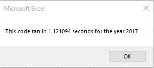
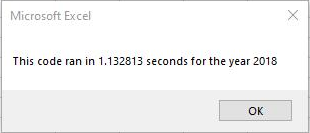
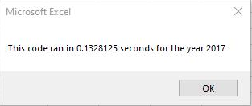
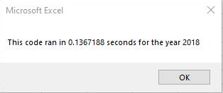

# stock-analysis

Performing data analysis on stocks data using Visual Basic for Applications (VBA).

## VBA Stock Market Analysis

## Background

The stakeholders were interested in performing an analysis of thousands of stocks over multiple years using Excel and VBA.

## Overview of Project

This analysis aims to provide the “total daily volume” and “yearly return”  for twelve stocks of interest for a given year.

### Purpose

The purpose of this project had two objectives: (1) To provide an initial analysis of thousands of stocks to find the “total daily volume” and “yearly return” for each stock over a given year. (2) To edit or refactor our initial analysis to loop through all the data one time to collect the same information. Then, we will compare the outcome against the initial analysis to determine whether refactoring the code successfully made the VBA script run faster.

### Analysis of Outcomes

The initial code (asynchronous) iterates over the entire year's worth of stock data once for each “stock of interest”. This required twelve separate iterations over the entire year's data. The results for each of the two years analyzed is shown below in Fig 1.1 and Fig 1.2

 Figure 1.1 Initial AllStockAnalysis_2017

Figure 1.2 Initial_AllStockAnalysis_2018

The refactored (synchronous) code iterated over all data for a given year only once while still capturing all necessary values needed to update the summary table as shown below in Fig 1.3 and 1.4

Figure 1.3 VBA_Challenge_2017_Refactored

Figure 1.4 VBA_Challenge_2018_Refactored

If we compare the output values in the summary tables for the original code (AllStockAnalysis) and the refactored code (VBA_Challenge), we can see that both outcomes are the same as shown in Fig 1.1 to 1.4. This means that our refactored code preserved the same functionalities as our original code, but with improved runtimes.

## Results

### Outcomes of Original Code Analysis (AllStockAnalysis)

- Runtime for year 2017 was **1.121094**

- Runtime for year 2018 was **1.132813**

### Outcomes of Refactored Code Analysis (VBA_Challenge)

- Runtime for year 2017 was **0.1328125**

- Runtime for year 2018 was **0.1367188**

### Overall decrease in runtime and decrease in percentage using 2017 data

Overall decrease = original time (asynchronous time) - new time (synchronous time) 

Overall decrease = 1.121094 - 0.1328125 

Overall decrease = **0.9882815**

Percentage runtime reduction = (overall decrease / original time) *100 

Percentage runtime reduction = (0.9882815 / 1.121094)* 100 = **88.15%**

### Overall decrease in runtime and decrease in percentage using 2018 data

Overall decrease = original time (asynchronous time) - new time (synchronous time 

Overall decrease = 1.132813 -  0.1367188 

Overall decrease = **0.9960942**

Percentage runtime reduction = (overall decrease / original time) *100 

Percentage runtime reduction = (0.9960942 / 1.132813)* 100 = **87.93%**

## Summary
 
### Pros and Cons:
#### In general:
 
- In general, the advantages of refactoring a code include a reduced runtime which saved time while maintaining all the same functionalities of the original code. 
- It also reduces complexity and redundancies and increases maintainability of the code.
- However, this comes at a cost to include the time required to refactor the code.
- Additionally, anytime code is refactored there is a potential of introducing new bugs and errors to an already working code.
- Sometimes when large teams are working on refactoring the same code, coordination can represent a challenge since it requires greater communication within the team.
 
 
#### Specific for the refactored VBA code

- The results of the refactoring the already working VBA script represented an **88%** decrease in runtime while still achieving the identical summary results as shown in tables Fig 1.1 to 1.4
- We improved the legibility and comprehensibility of the code, now it is easier to read without the additional nested ”for loop” and macros.
 
 [Markdown Reference 1](https://docs.github.com/en/get-started/writing-on-github/getting-started-with-writing-and-formatting-on-github/basic-writing-and-formatting-syntax) 
 [Markdown Reference 2](https://www.markdownguide.org/basic-syntax/)
