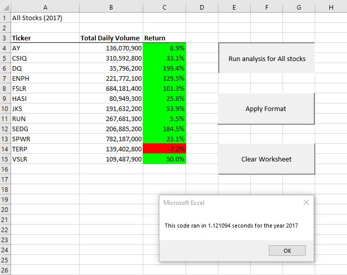
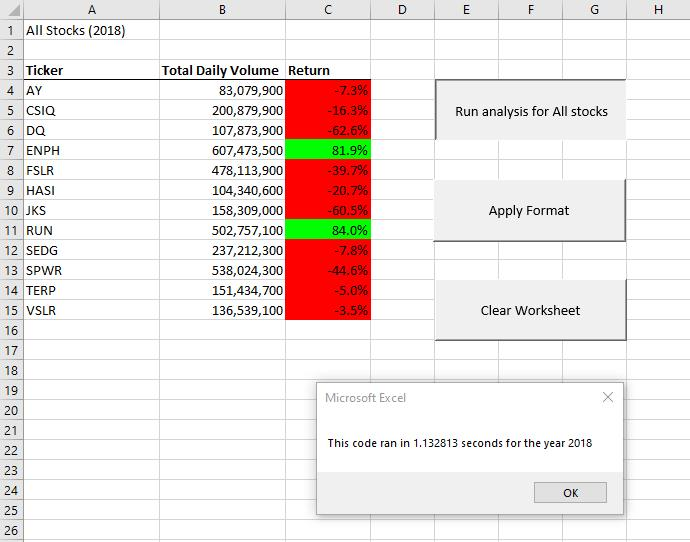
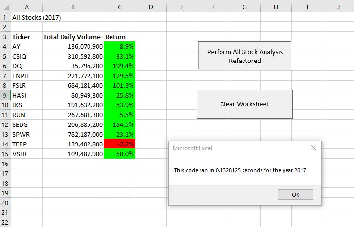
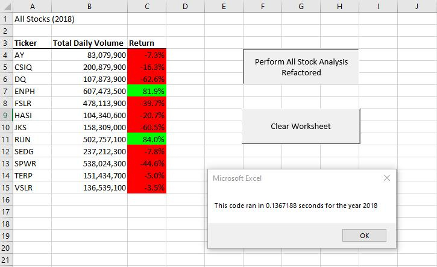
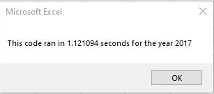
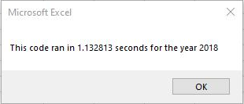

# stock-analysis

Performing data analysis on stocks data using Visual Basic for Applications (VBA).

## VBA Stock Market Analysis

## Background

The stakeholders were interested in performing an analysis of  thousands of stocks over multiple years using Excel and  VBA.

## Overview of Project

This analysis aims to provide the total daily volume and yearly return for twelve “stocks of interest” for a given year.

### Purpose

The purpose of this project had two objectives: (1)To provide the Stakeholders an initial analysis of thousands of stocks to find the total daily volume and yearly return for each stock over a given year. (2). To edit or refactor our initial analysis to loop through all the data one time to collect the same information. Then, we compared the outcome against the initial analysis to determine whether refactoring the code successfully made the VBA script run faster.

### Analysis of Outcomes

The initial code iterated over the entire year worth of stock data once for each “stock of interest”. This required twelve separated iterations  over the entire year's data. The results for each of the two years analyzed is show below in Fig 1.1 and Fig 1.2

 Figure 1.1 Initial Green_stocks_analysis 2017

Figure 1.2 Initial_Green_stocks_analysis 2018

Figure 1.3 VBA_Challenge_2017_Refactored

Figure 1.4 VBA_Challenge_2018_Refactored

## Results

### Outcomes of Original code analysis

- Runtime for year 2017 was 1.121094

- Runtime for year 2018 was 1.132813

### Outcomes of Refactored code analysis

- Runtime for year 2017 was 0.1328125

- Runtime for year 2018 was 0.1367188

### Overall decrease in runtime and decrease in percentage using 2017 data

Overall decrease = original time (asynchronous) - new synchronous
Overall decrease = 1.121094 - 0.1328125
OD = 0.9882815

Percentage runtime reduction = (overall decrease / original) time *100
Percentage runtime reduction = (0.9882815 / 1.121094)* 100 = 88.15%

### Overall decrease in runtime and decrease in percentage using 2018 data

Overall decrease = original time (asynchronous) - new synchronous
Overall decrease = 1.132813 -  0.1367188
OD = 0.9960942

Percentage runtime reduction = (overall decrease / original) time *100
Percentage runtime reduction = (0.9960942 / 1.132813)* 100 = 87.93%

## Summary
